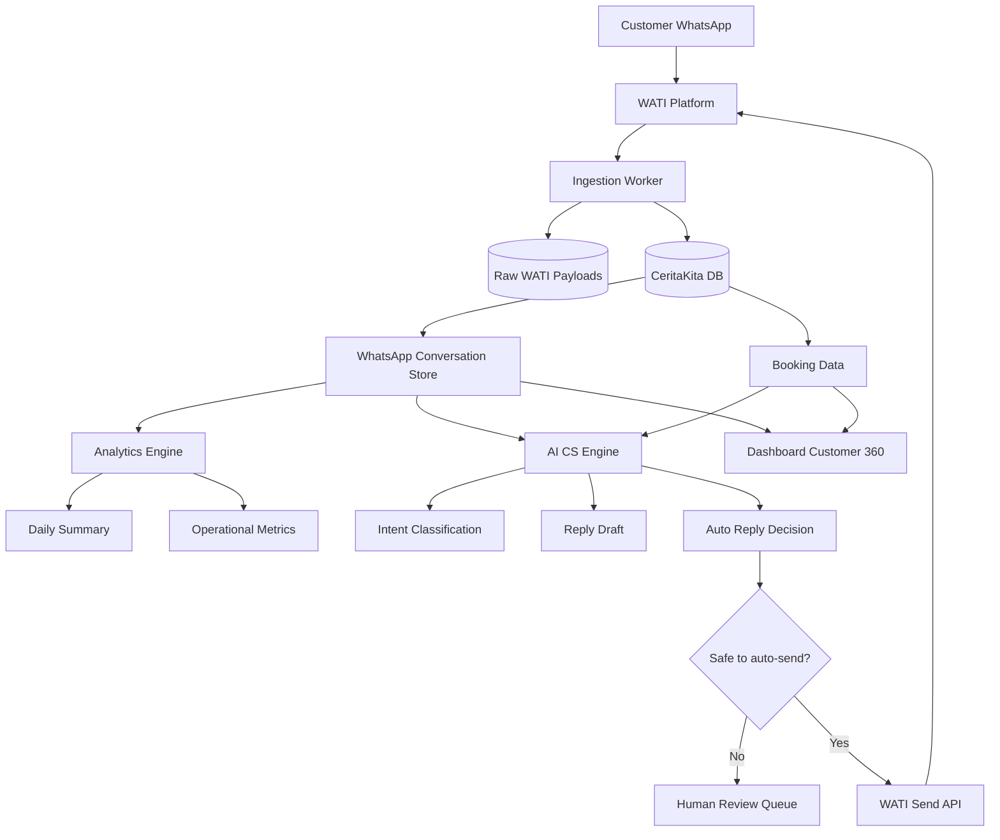

# Blueprint AI CS WhatsApp CeritaKita via WATI

Tanggal: 2026-06-04  
Status: Draft implementasi jangka panjang  
Owner: CeritaKita Booking  
Scope: WhatsApp data capture, analytics percakapan, customer 360, dan AI-assisted/AI auto-reply.

---

## 1. Ringkasan Eksekutif

CeritaKita sudah terintegrasi dengan WATI dan sudah mulai mengumpulkan percakapan WhatsApp lewat polling ke SQLite `wati_chats.db`. Arah berikutnya yang paling strategis adalah menjadikan seluruh percakapan WhatsApp sebagai aset data internal CeritaKita, lalu menggunakannya untuk:

1. menyimpan semua histori komunikasi customer secara rapi;
2. menganalisis kualitas layanan CS dan potensi booking;
3. menghubungkan chat dengan data booking/customer;
4. membantu CS membuat balasan lebih cepat;
5. secara bertahap mengaktifkan AI auto-reply untuk kasus yang aman.

Rekomendasi utama: **jangan langsung full AI auto-reply**. Bangun bertahap:

```text
Data Capture → Analytics → AI Draft Reply → Limited Auto-Reply → Full AI CS dengan Human Handover
```

Alasan: percakapan WhatsApp adalah touchpoint utama customer. Kesalahan AI pada harga, jadwal, pembayaran, cancel/reschedule, atau komplain bisa merusak trust. Karena itu AI perlu dimulai sebagai assistant/draft generator dulu, bukan pengambil keputusan penuh.

---

## 2. Tujuan Produk

### 2.1 Tujuan utama

- Semua percakapan WhatsApp dari WATI tersimpan di database CeritaKita.
- Tim bisa melihat riwayat chat customer bersama data booking.
- Sistem bisa membuat analisa harian/mingguan otomatis.
- AI bisa membantu memahami intent, sentiment, urgency, dan potensi booking.
- AI bisa menyarankan balasan, lalu bertahap mengirim balasan otomatis untuk skenario low-risk.

### 2.2 Tujuan bisnis

- Mengurangi chat yang tidak terbalas.
- Menurunkan response time.
- Meningkatkan conversion dari chat ke booking.
- Mengetahui alasan customer batal/tidak lanjut booking.
- Mengidentifikasi pertanyaan yang paling sering muncul.
- Membantu owner/CS membuat keputusan berdasarkan data percakapan.

### 2.3 Non-goals tahap awal

- Bukan mengganti CS 100% dari hari pertama.
- Bukan mengirim campaign marketing massal tanpa opt-in.
- Bukan membuat AI bebas menjawab semua kasus sensitif.
- Bukan memindahkan semua workflow WATI dalam satu fase besar.

---

## 3. Kondisi Saat Ini

### 3.1 Yang sudah berjalan

| Komponen | Status | Catatan |
|---|---:|---|
| Polling WATI tiap 10 menit | ✅ | Berjalan di VPS |
| SQLite `wati_chats.db` | ✅ | Menampung data awal |
| Pemahaman pola API template v3 | ✅ | Body pakai `snake_case`, `recipients` array of objects |
| Template send API | ⚠️ | Bisa dipanggil, tapi kontak perlu opt-in |
| Session/free-form send API | ❌/⚠️ | `sendSessionMessage` dan `sendMessage` masih 404 di percobaan saat ini |

### 3.2 Blocker utama

Pengiriman pesan bebas via API belum stabil:

- `sendSessionMessage` mengembalikan 404.
- `sendMessage` mengembalikan 404.
- `messageTemplates/send` tersedia, tetapi mengembalikan error seperti `no valid Receivers` jika kontak belum opted-in/target tidak valid.

Catatan endpoint WATI yang relevan:

- WATI v1 session message: `POST {WATI_API_ENDPOINT}/api/v1/sendSessionMessage/{whatsappNumber}` dengan query param `messageText`.
- WATI v3 conversation text: `POST https://live-mt-server.wati.io/api/ext/v3/conversations/messages/text` dengan body `target` dan `text`.
- WATI v3 template send: `POST https://live-mt-server.wati.io/api/ext/v3/messageTemplates/send` dengan body `template_name`, `broadcast_name`, dan `recipients`.
- WATI v1/v2 bulk template masih memakai field `receivers`, bukan `recipients`.

Referensi:

- https://docs.wati.io/reference/post_api-v1-sendsessionmessage-whatsappnumber
- https://docs.wati.io/reference/post_api-ext-v3-conversations-messages-text
- https://docs.wati.io/reference/post_api-ext-v3-messagetemplates-send
- https://docs.wati.io/reference/post_api-v1-sendtemplatemessages

---

## 4. Prinsip Desain Sistem

### 4.1 Data-first

Semua pesan harus disimpan dulu sebelum dianalisis atau dibalas. Jangan bergantung hanya pada WATI dashboard karena:

- data internal bisa dihubungkan ke booking;
- analisis bisa dilakukan bebas;
- histori tetap bisa diaudit;
- AI butuh konteks jangka panjang;
- dashboard internal bisa dibuat sesuai kebutuhan CeritaKita.

### 4.2 Idempotent ingestion

Polling/webhook bisa menerima pesan yang sama lebih dari sekali. Sistem harus aman terhadap duplikasi.

Aturan:

- simpan `wati_message_id` atau identifier unik lain;
- gunakan unique constraint;
- jika payload sama masuk lagi, update status/timestamp bila perlu, jangan insert pesan duplikat.

### 4.3 Raw payload tetap disimpan

Selain data normalized, simpan payload mentah dari WATI. Ini penting untuk:

- debugging;
- perubahan format API WATI;
- audit;
- backfill data jika schema berubah.

### 4.4 Human-in-the-loop

AI harus punya mode bertahap:

1. `observe_only`: hanya klasifikasi, tidak membuat draft.
2. `draft_only`: AI buat draft, CS review.
3. `auto_low_risk`: AI boleh kirim untuk intent aman.
4. `auto_with_handover`: AI berjalan, tapi eskalasi ke manusia untuk kasus tertentu.

### 4.5 Safety guardrails

AI tidak boleh:

- mengarang harga/promo;
- menjanjikan slot jadwal tanpa validasi booking;
- mengubah booking tanpa konfirmasi;
- memberi janji refund/cancel tanpa SOP;
- membalas komplain emosional secara generik;
- mengirim data sensitif customer lain;
- mengabaikan opt-out.

---

## 5. Arsitektur Target



### 5.1 Komponen utama

| Komponen | Fungsi |
|---|---|
| WATI Platform | Gateway WhatsApp, dashboard CS, template/chatbot bawaan |
| Ingestion Worker | Ambil data chat dari WATI via polling/webhook |
| Raw Payload Store | Menyimpan payload asli WATI |
| Conversation Store | Schema normalized untuk kontak, conversation, message |
| Analytics Engine | Menghitung metrik harian/mingguan |
| AI CS Engine | Klasifikasi intent, sentiment, draft balasan, auto-reply terbatas |
| Dashboard Customer 360 | Menampilkan chat, booking, status pembayaran, insight |
| Human Review Queue | Draft AI yang perlu dicek CS |
| Outbox | Queue pesan yang akan dikirim ke WATI |

---

## 6. Data Model Rekomendasi

> Catatan: nama tabel bisa disesuaikan dengan konvensi schema aplikasi saat implementasi.

### 6.1 `wati_raw_events`

Menyimpan payload mentah dari WATI.

| Field | Type | Catatan |
|---|---|---|
| `id` | UUID/string | Primary key internal |
| `event_type` | string | `message`, `status`, `contact`, dll |
| `wati_id` | string nullable | ID dari WATI bila ada |
| `payload` | JSON/text | Raw payload lengkap |
| `received_at` | datetime | Waktu sistem menerima data |
| `processed_at` | datetime nullable | Waktu selesai diproses |
| `processing_status` | string | `pending`, `processed`, `failed` |
| `error_message` | text nullable | Error bila gagal parse |

### 6.2 `whatsapp_contacts`

Menyimpan identitas kontak WhatsApp.

| Field | Type | Catatan |
|---|---|---|
| `id` | UUID/string | Primary key |
| `phone_number` | string | Format E.164 atau format WATI normalized |
| `display_name` | string nullable | Nama dari WATI/customer |
| `wati_contact_id` | string nullable | ID kontak WATI |
| `is_opted_in` | boolean nullable | Status opt-in jika tersedia |
| `opted_in_at` | datetime nullable | Waktu opt-in |
| `last_message_at` | datetime nullable | Pesan terakhir |
| `linked_customer_id` | string nullable | Relasi ke customer app |
| `created_at` | datetime |  |
| `updated_at` | datetime |  |

Index penting:

- unique `phone_number`
- index `wati_contact_id`
- index `last_message_at`

### 6.3 `whatsapp_conversations`

Menyimpan sesi/percakapan.

| Field | Type | Catatan |
|---|---|---|
| `id` | UUID/string | Primary key |
| `wati_conversation_id` | string nullable | ID conversation dari WATI jika ada |
| `contact_id` | FK | Relasi ke `whatsapp_contacts` |
| `status` | string | `open`, `pending_human`, `resolved`, `archived` |
| `assigned_to` | string nullable | CS/user internal |
| `last_inbound_at` | datetime nullable | Pesan terakhir dari customer |
| `last_outbound_at` | datetime nullable | Pesan terakhir dari CS/bot |
| `last_message_at` | datetime nullable | Pesan terakhir semua arah |
| `last_intent` | string nullable | Intent terakhir |
| `last_sentiment` | string nullable | Sentiment terakhir |
| `booking_id` | string nullable | Booking terkait jika sudah match |
| `created_at` | datetime |  |
| `updated_at` | datetime |  |

### 6.4 `whatsapp_messages`

Menyimpan pesan normalized.

| Field | Type | Catatan |
|---|---|---|
| `id` | UUID/string | Primary key |
| `wati_message_id` | string nullable | Unique bila tersedia |
| `conversation_id` | FK | Relasi conversation |
| `contact_id` | FK | Relasi contact |
| `direction` | string | `incoming`, `outgoing` |
| `sender_type` | string | `customer`, `owner`, `cs`, `bot`, `system` |
| `message_type` | string | `text`, `image`, `audio`, `video`, `document`, `template`, `interactive`, dll |
| `text` | text nullable | Isi text |
| `media_url` | text nullable | Jika ada media |
| `media_mime_type` | string nullable |  |
| `reply_to_message_id` | string nullable | Context reply |
| `status` | string nullable | `sent`, `delivered`, `read`, `failed` |
| `wati_timestamp` | datetime | Timestamp dari WATI |
| `created_at` | datetime | Waktu insert internal |
| `raw_event_id` | FK nullable | Relasi ke raw payload |

Index penting:

- unique `wati_message_id`
- index `conversation_id, wati_timestamp`
- index `contact_id, wati_timestamp`
- index `direction, wati_timestamp`

### 6.5 `ai_message_analysis`

Menyimpan hasil analisa AI per pesan/percakapan.

| Field | Type | Catatan |
|---|---|---|
| `id` | UUID/string | Primary key |
| `message_id` | FK nullable | Bisa per pesan |
| `conversation_id` | FK | Bisa per conversation |
| `intent` | string | Contoh: `ask_price`, `ask_schedule`, `booking_request` |
| `sentiment` | string | `positive`, `neutral`, `negative`, `angry`, `confused` |
| `urgency` | string | `low`, `medium`, `high` |
| `booking_potential` | string | `low`, `medium`, `high` |
| `needs_human` | boolean | Apakah perlu CS manusia |
| `summary` | text nullable | Ringkasan konteks |
| `extracted_entities` | JSON/text | Nama, tanggal, paket, lokasi, dll |
| `confidence` | float | 0-1 |
| `model_name` | string | Model AI yang dipakai |
| `created_at` | datetime |  |

### 6.6 `ai_reply_drafts`

Menyimpan draft/hasil balasan AI.

| Field | Type | Catatan |
|---|---|---|
| `id` | UUID/string | Primary key |
| `conversation_id` | FK |  |
| `trigger_message_id` | FK | Pesan customer yang memicu draft |
| `draft_text` | text | Isi balasan AI |
| `mode` | string | `draft_only`, `auto_low_risk`, dll |
| `status` | string | `drafted`, `approved`, `rejected`, `sent`, `failed` |
| `risk_level` | string | `low`, `medium`, `high` |
| `confidence` | float | 0-1 |
| `reviewed_by` | string nullable | User yang approve/reject |
| `reviewed_at` | datetime nullable |  |
| `sent_message_id` | FK nullable | Outgoing message hasil kirim |
| `model_name` | string |  |
| `prompt_version` | string |  |
| `created_at` | datetime |  |

### 6.7 `message_outbox`

Queue pengiriman pesan ke WATI.

| Field | Type | Catatan |
|---|---|---|
| `id` | UUID/string | Primary key |
| `conversation_id` | FK |  |
| `contact_id` | FK |  |
| `channel` | string | `wati` |
| `send_type` | string | `session_text`, `template`, `interactive` |
| `payload` | JSON/text | Payload yang akan dikirim |
| `status` | string | `pending`, `sending`, `sent`, `failed`, `cancelled` |
| `attempt_count` | int | Retry counter |
| `last_error` | text nullable | Error terakhir |
| `scheduled_at` | datetime | Kapan dikirim |
| `sent_at` | datetime nullable |  |
| `created_at` | datetime |  |
| `updated_at` | datetime |  |

---

## 7. Ingestion Strategy

### 7.1 Polling vs webhook

| Opsi | Kelebihan | Kekurangan | Rekomendasi |
|---|---|---|---|
| Polling tiap 10 menit | Mudah, sudah berjalan | Delay, bisa miss jika pagination salah, boros request | Tetap dipakai fase awal |
| Webhook WATI | Real-time, lebih efisien | Perlu endpoint publik dan signature/security | Target jangka menengah |
| Hybrid | Aman: webhook real-time + polling backfill | Lebih kompleks | Target ideal |

Rekomendasi:

- Fase awal: lanjutkan polling, tapi rapikan dedupe dan raw payload.
- Fase berikutnya: tambah webhook bila WATI plan mendukung.
- Tetap jalankan polling backfill berkala meskipun webhook aktif.

### 7.2 Flow ingestion

```text
Cron/Worker jalan
  ↓
Ambil conversations/messages dari WATI
  ↓
Simpan raw payload ke wati_raw_events
  ↓
Normalize contact
  ↓
Normalize conversation
  ↓
Insert/update message idempotently
  ↓
Update conversation last_message_at
  ↓
Trigger analysis queue bila pesan incoming baru
```

### 7.3 Aturan dedupe

Gunakan prioritas identifier:

1. `wati_message_id` / `message_id` / `wamid` jika tersedia.
2. kombinasi `phone_number + timestamp + direction + text_hash` jika ID tidak tersedia.
3. simpan `raw_event_id` untuk traceability.

### 7.4 Backfill

Backfill perlu untuk mengambil histori lama.

Strategi:

- Jalankan per contact/conversation.
- Ambil halaman dari terbaru ke lama.
- Stop jika semua pesan di halaman sudah ada.
- Batasi rate limit.
- Log progress.

---

## 8. Analytics dan Reporting

### 8.1 Daily Summary jam 09.00

Isi report harian:

- total pesan masuk kemarin;
- total conversation aktif;
- jumlah lead baru;
- jumlah conversation belum dibalas;
- median/average response time;
- jam tersibuk;
- top intent/topik;
- percakapan berpotensi booking tinggi;
- percakapan negatif/komplain;
- follow-up yang direkomendasikan.

Contoh output:

```text
Daily WhatsApp Summary - 2026-06-04

1. Volume
- 74 pesan masuk
- 29 conversation aktif
- 11 lead baru

2. Response Time
- Median response time: 12 menit
- 5 conversation belum dibalas > 1 jam

3. Topik Teratas
- Harga paket: 18x
- Jadwal tersedia: 13x
- Lokasi studio: 7x
- Reschedule: 4x

4. High Potential Leads
- +628xxx: tanya paket newborn dan slot minggu depan
- +628xxx: sudah minta invoice

5. Risiko
- 2 percakapan bernada kecewa/komplain
```

### 8.2 Metrik response time

Definisi sederhana:

- `incoming_at`: timestamp pesan customer.
- `first_reply_at`: outbound pertama setelah incoming tersebut.
- response time = `first_reply_at - incoming_at`.

Perlu pengecualian:

- pesan di luar jam kerja;
- pesan auto-reply bot;
- pesan spam;
- conversation yang sudah closed.

Metrik yang disarankan:

- median response time;
- P90 response time;
- jumlah chat belum dibalas > 30 menit, > 1 jam, > 6 jam;
- response time per CS.

### 8.3 Intent taxonomy awal

| Intent | Deskripsi | Risk |
|---|---|---:|
| `greeting` | Sapaan awal | Low |
| `ask_price` | Tanya harga/paket | Low/Medium |
| `ask_schedule` | Tanya slot/jadwal | Medium |
| `booking_request` | Ingin booking | Medium |
| `ask_location` | Tanya lokasi/alamat | Low |
| `ask_payment` | Tanya pembayaran/DP | Medium |
| `send_proof_payment` | Kirim bukti transfer | High |
| `reschedule_request` | Minta ubah jadwal | High |
| `cancel_request` | Minta cancel booking | High |
| `complaint` | Komplain | High |
| `follow_up` | Lanjutan percakapan | Medium |
| `spam_or_irrelevant` | Spam/tidak relevan | Low |
| `unknown` | Tidak yakin | High by default |

### 8.4 Booking conversion analytics

Jika chat sudah bisa dihubungkan dengan booking:

- chat → booking created;
- chat → booking paid;
- chat → no response;
- chat → lost karena harga;
- chat → lost karena slot tidak tersedia;
- chat → lost karena lokasi/jarak;
- chat → reschedule/cancel.

Ini akan jadi insight bisnis yang sangat bernilai.

---

## 9. AI CS Engine

### 9.1 Peran AI

AI tidak hanya untuk membalas pesan. AI juga bisa:

- klasifikasi intent;
- ekstraksi nama, tanggal, paket, umur anak, lokasi;
- ringkas conversation;
- deteksi urgency;
- deteksi komplain/sentimen negatif;
- rekomendasi next action;
- membuat draft balasan;
- auto-reply untuk skenario aman.

### 9.2 Mode operasional

| Mode | Deskripsi | Kapan dipakai |
|---|---|---|
| `observe_only` | AI hanya menganalisa, tidak buat draft | Awal implementasi |
| `draft_only` | AI buat draft, CS kirim manual | Setelah klasifikasi stabil |
| `auto_low_risk` | AI boleh kirim untuk intent aman | Setelah diuji |
| `auto_business_hours` | AI aktif hanya jam kerja | Operasional normal awal |
| `auto_with_handover` | AI jawab, eskalasi kasus high-risk | Target matang |

### 9.3 Guardrails auto-reply

AI boleh auto-reply jika semua syarat terpenuhi:

- intent termasuk low-risk;
- confidence minimal, misalnya `>= 0.85`;
- bukan komplain/cancel/refund/pembayaran;
- tidak membutuhkan cek jadwal real-time;
- tidak mengandung data sensitif;
- customer belum meminta manusia;
- conversation belum diambil alih CS;
- tidak lebih dari batas auto-reply per conversation.

Jika tidak terpenuhi, AI hanya membuat draft dan assign ke human.

### 9.4 Intent yang aman untuk auto-reply awal

| Intent | Contoh balasan aman |
|---|---|
| `greeting` | Sapaan dan tawarkan bantuan |
| `ask_location` | Kirim alamat/link lokasi |
| `ask_basic_package` | Beri info paket umum sesuai template resmi |
| `ask_operating_hours` | Jam operasional |
| `ask_booking_steps` | Cara booking umum |
| `need_customer_data` | Minta nama, tanggal, paket yang diminati |

### 9.5 Intent yang wajib human review

- pembayaran/bukti transfer;
- refund;
- cancel;
- reschedule;
- komplain;
- jadwal bentrok;
- perubahan harga/promo;
- customer marah;
- pertanyaan legal/privasi;
- AI confidence rendah.

### 9.6 Prompt policy ringkas

AI harus diarahkan untuk:

- bahasa ramah, natural, dan singkat;
- tidak terlalu kaku seperti robot;
- menanyakan satu hal penting per balasan;
- tidak mengarang data;
- jika butuh jadwal/harga pasti, cek knowledge base/tool/data dulu;
- jika tidak yakin, eskalasi ke CS.

Contoh system instruction internal:

```text
Kamu adalah assistant CS CeritaKita. Tugasmu membantu membalas customer WhatsApp dengan ramah, singkat, dan akurat.
Jangan mengarang harga, slot jadwal, promo, kebijakan refund, atau status pembayaran.
Jika customer membahas komplain, cancel, refund, reschedule, pembayaran, atau kasus sensitif, jangan auto-kirim; buat draft dan tandai perlu human review.
Gunakan bahasa Indonesia natural. Maksimal 2 paragraf pendek. Tanyakan satu next step yang jelas.
```

---

## 10. Knowledge Base untuk AI

AI perlu sumber kebenaran internal, bukan hanya training model umum.

### 10.1 Isi knowledge base minimal

- daftar paket CeritaKita;
- harga dan inclusions;
- add-on;
- lokasi studio;
- jam operasional;
- alur booking;
- aturan DP/pelunasan;
- aturan reschedule/cancel;
- FAQ;
- template jawaban brand voice;
- daftar hal yang tidak boleh dijanjikan AI.

### 10.2 Format awal sederhana

Bisa mulai dari file Markdown/YAML/JSON di repo/admin panel:

```yaml
packages:
  - name: Paket A
    price: 0
    description: "Isi sesuai data resmi"
    notes: "Jangan tampilkan jika belum final"

policies:
  booking:
    dp_required: true
    notes: "Ikuti SOP resmi"
  reschedule:
    human_review_required: true
```

### 10.3 Versi knowledge base

Setiap reply AI sebaiknya menyimpan:

- `knowledge_base_version`;
- `prompt_version`;
- `model_name`.

Tujuannya supaya jika ada balasan salah, bisa dilacak menggunakan versi data apa.

---

## 11. WATI Sending Strategy

### 11.1 Jenis pesan

| Jenis | Dipakai untuk | Catatan |
|---|---|---|
| Session/free-form message | Balasan dalam active conversation/customer service window | Target utama AI auto-reply |
| Template message | Follow-up/proactive/outside session | Perlu approved template dan opt-in |
| Interactive/list/button | Pilihan paket/jadwal/FAQ | Bagus untuk flow terstruktur |

### 11.2 Debug checklist `sendSessionMessage` 404

Jika endpoint mengembalikan 404, cek:

1. Apakah base URL adalah API endpoint tenant WATI yang benar?
2. Apakah endpoint v1 dipanggil ke domain v1, bukan domain v3?
3. Apakah path tepat: `/api/v1/sendSessionMessage/{whatsappNumber}`?
4. Apakah `messageText` dikirim sebagai query param, bukan JSON body?
5. Apakah nomor memakai country code tanpa `+`?
6. Apakah customer sedang dalam opened session/active conversation?
7. Apakah channel phone number perlu dikirim sebagai query param `channelPhoneNumber`?
8. Apakah token punya permission untuk messaging?
9. Apakah fitur endpoint aktif di plan/tenant WATI?
10. Apakah ada endpoint v3 yang lebih cocok: `/api/ext/v3/conversations/messages/text`?

### 11.3 Debug checklist template `no valid Receivers`

Cek:

1. Nomor receiver valid dan pakai country code.
2. Contact sudah opt-in jika diperlukan.
3. Template sudah approved.
4. Template name tepat, case-sensitive.
5. Channel number sesuai.
6. Untuk v3 gunakan `recipients`, untuk v1/v2 gunakan `receivers`.
7. Struktur parameters sesuai template.
8. Recipient object memiliki field yang sesuai dokumentasi WATI tenant.

### 11.4 Outbox pattern

Jangan kirim langsung dari AI process. Pakai outbox:

```text
AI membuat keputusan kirim
  ↓
Insert row message_outbox status=pending
  ↓
Worker mengambil pending outbox
  ↓
Kirim ke WATI
  ↓
Simpan response mentah
  ↓
Update status sent/failed
  ↓
Insert outgoing message jika sukses
```

Manfaat:

- retry lebih aman;
- audit jelas;
- tidak double-send;
- bisa pause auto-reply;
- bisa inspeksi error.

---

## 12. Integrasi dengan CeritaKita Booking

### 12.1 Customer matching

Prioritas matching:

1. phone number sama dengan customer booking;
2. nama + phone number mirip;
3. booking yang dibuat setelah chat dimulai;
4. manual link oleh CS/admin.

### 12.2 Customer 360 view

Dashboard ideal menampilkan:

- profil customer;
- semua booking customer;
- status booking terbaru;
- payment status;
- histori WhatsApp;
- AI summary percakapan;
- intent dan next action;
- draft balasan AI;
- tombol approve/edit/send.

### 12.3 Booking-aware AI

AI boleh menggunakan data booking untuk membantu CS, tapi harus hati-hati.

Contoh aman:

- “Aku lihat booking atas nama X sedang menunggu konfirmasi pembayaran.”
- “Untuk perubahan jadwal, aku bantu teruskan ke admin ya.”

Contoh tidak aman:

- “Slot tanggal itu tersedia” tanpa cek kalender real-time.
- “Pembayaran sudah masuk” tanpa validasi payment status.
- “Refund pasti diproses” tanpa SOP dan approval.

---

## 13. Security, Privacy, dan Compliance

### 13.1 Data sensitif

Percakapan WhatsApp bisa mengandung:

- nomor telepon;
- nama anak/orang tua;
- alamat;
- bukti pembayaran;
- data booking;
- keluhan pribadi.

Perlindungan minimal:

- token WATI disimpan di environment variable;
- jangan log token/API key;
- batasi akses dashboard;
- simpan raw payload dengan akses terbatas;
- jangan kirim seluruh history panjang ke AI tanpa kebutuhan;
- masking nomor telepon di report umum;
- audit siapa yang membaca/mengirim pesan jika memungkinkan.

### 13.2 Retention policy

Rekomendasi awal:

- normalized message: simpan sesuai kebutuhan bisnis;
- raw payload: simpan 90-180 hari, lalu archive/delete;
- AI logs: simpan minimal untuk audit, tapi jangan berlebihan;
- media/bukti pembayaran: perlakukan sebagai data sensitif.

### 13.3 Opt-in dan opt-out

Untuk template/proactive message:

- pastikan customer opt-in;
- simpan status opt-in jika tersedia;
- hormati opt-out;
- jangan gunakan AI untuk broadcast marketing tanpa aturan jelas.

---

## 14. Reliability dan Monitoring

### 14.1 Monitoring ingestion

Alert jika:

- polling gagal > 3 kali berturut-turut;
- tidak ada pesan masuk sama sekali dalam periode yang tidak wajar;
- error parsing meningkat;
- duplikasi pesan meningkat tajam;
- API WATI rate limited.

### 14.2 Monitoring AI

Pantau:

- jumlah draft dibuat;
- approval rate draft;
- edit distance antara draft dan final CS;
- auto-reply count;
- auto-reply failure rate;
- human escalation rate;
- complaint after AI reply;
- cost LLM per hari/bulan.

### 14.3 Kill switch

Harus ada cara cepat untuk mematikan AI auto-send:

- env var: `AI_CS_AUTO_SEND_ENABLED=false`
- admin setting di dashboard;
- fallback ke draft-only.

---

## 15. Roadmap Implementasi

### Fase 0 — Data Collection Stabil

Status: sedang berjalan.

Target:

- polling WATI stabil;
- raw payload tersimpan;
- normalized messages tersimpan;
- dedupe aman;
- log error jelas.

Checklist:

- [ ] Review schema SQLite saat ini.
- [ ] Tambah unique key untuk message ID.
- [ ] Simpan raw payload.
- [ ] Simpan timestamp WATI dan timestamp internal.
- [ ] Buat script backfill.
- [ ] Buat health check polling.

### Fase 1 — Integrasi ke Database CeritaKita

Target:

- chat masuk ke DB utama aplikasi;
- endpoint internal tersedia;
- dashboard bisa membaca data chat.

Endpoint internal awal:

```http
POST /api/wati/messages
GET  /api/admin/whatsapp/conversations
GET  /api/admin/whatsapp/conversations/:id/messages
POST /api/admin/whatsapp/conversations/:id/link-booking
```

Checklist:

- [ ] Buat schema DB utama.
- [ ] Buat API ingestion internal.
- [ ] Worker polling push data ke API internal.
- [ ] Buat halaman basic inbox/customer chat.
- [ ] Link phone number ke booking/customer.

### Fase 2 — Analytics Harian

Target:

- daily report otomatis;
- insight operasional;
- daftar follow-up.

Checklist:

- [ ] Query volume harian.
- [ ] Query response time.
- [ ] Query unresponded conversation.
- [ ] Intent extraction sederhana.
- [ ] Daily summary via email/WhatsApp/internal dashboard.

### Fase 3 — AI Analysis dan Draft Reply

Target:

- AI menganalisis pesan masuk;
- AI membuat draft;
- CS review sebelum kirim.

Checklist:

- [ ] Definisikan intent taxonomy.
- [ ] Buat prompt classifier.
- [ ] Buat prompt reply draft.
- [ ] Simpan hasil ke `ai_message_analysis` dan `ai_reply_drafts`.
- [ ] Dashboard approve/edit/reject draft.
- [ ] Evaluasi kualitas selama 1-2 minggu.

### Fase 4 — Limited Auto-Reply

Target:

- auto-reply untuk intent aman;
- human handover untuk intent berisiko.

Checklist:

- [ ] Selesaikan WATI session send API.
- [ ] Implement outbox.
- [ ] Implement kill switch.
- [ ] Auto-reply hanya jam kerja.
- [ ] Confidence threshold.
- [ ] Rate limit per conversation.
- [ ] Audit semua auto-reply.

### Fase 5 — Full AI CS Assisted Operations

Target:

- AI jadi layer CS utama untuk pertanyaan umum;
- CS fokus pada booking, komplain, pembayaran, dan kasus kompleks.

Checklist:

- [ ] Knowledge base terstruktur.
- [ ] AI bisa cek booking context.
- [ ] AI bisa menawarkan next step booking.
- [ ] SLA dashboard.
- [ ] Continuous evaluation.
- [ ] SOP escalation.

---

## 16. MVP yang Disarankan

MVP paling masuk akal:

1. **Simpan semua chat ke DB utama.**
2. **Dashboard list conversation + detail messages.**
3. **Daily summary jam 09.00.**
4. **AI classify intent + sentiment.**
5. **AI draft reply, belum auto-send.**

Kenapa ini MVP terbaik:

- langsung bermanfaat;
- risiko rendah;
- tidak terblokir sepenuhnya oleh send API;
- memberi data untuk mengevaluasi AI;
- fondasi kuat untuk auto-reply nanti.

---

## 17. Open Questions

Pertanyaan yang perlu dijawab sebelum implementasi penuh:

1. Database utama aplikasi saat ini apa dan schema booking/customer seperti apa?
2. Apakah WATI mendukung webhook di plan yang dipakai?
3. Apakah endpoint v3 conversation text tersedia di tenant CeritaKita?
4. Bagaimana format payload polling WATI saat ini?
5. Bagaimana cara menandai pesan dari owner/CS vs bot?
6. Apakah semua customer sudah punya opt-in untuk template?
7. Jam kerja CS yang disepakati apa?
8. SOP harga, DP, cancel, dan reschedule sudah final?
9. Apakah AI boleh membaca data booking/payment?
10. Channel report harian mau dikirim ke mana?

---

## 18. Risiko dan Mitigasi

| Risiko | Dampak | Mitigasi |
|---|---|---|
| AI salah jawab harga/jadwal | Trust customer turun | Draft-only dulu, knowledge base resmi, no auto untuk jadwal/harga pasti |
| Double-send pesan | Customer terganggu | Outbox + idempotency key |
| Data chat duplikat | Analytics kacau | Unique message ID + dedupe hash |
| WATI API berubah/berbeda antar versi | Send/ingestion gagal | Simpan raw payload, adapter per versi API |
| Kontak belum opt-in | Template gagal | Track opt-in, fallback human/session reply |
| Token bocor | Security incident | Env var, no token logs, rotate token |
| AI cost membengkak | Biaya operasional naik | Batch analysis, cache summary, model routing |
| CS bingung dengan draft AI | Adoption rendah | UI approve/edit sederhana, training SOP |

---

## 19. Acceptance Criteria Awal

Fase awal dianggap berhasil jika:

- minimal 95% pesan WATI masuk ke DB internal tanpa duplikasi;
- dashboard bisa menampilkan conversation dan message history;
- daily summary jalan otomatis;
- AI bisa klasifikasi intent dengan hasil yang cukup berguna;
- draft AI bisa dipakai CS untuk mempercepat balasan;
- tidak ada auto-reply high-risk yang terkirim tanpa review;
- semua outgoing message tercatat di DB.

---

## 20. Rekomendasi Final

Project ini sangat layak dilanjutkan. Nilai utamanya bukan hanya “AI menjawab WhatsApp”, tetapi membuat seluruh percakapan customer menjadi data operasional CeritaKita.

Urutan terbaik:

1. **Perkuat data capture.**
2. **Masukkan ke DB utama CeritaKita.**
3. **Bangun analytics harian dan customer 360.**
4. **Aktifkan AI untuk analisa dan draft.**
5. **Auto-reply bertahap hanya untuk intent aman.**
6. **Selesaikan WATI send API dan pakai outbox agar tidak double-send.**

Dengan urutan ini, CeritaKita dapat memperoleh insight cepat, mengurangi beban CS, dan menyiapkan AI CS yang aman serta scalable tanpa mengorbankan kualitas pengalaman customer.
