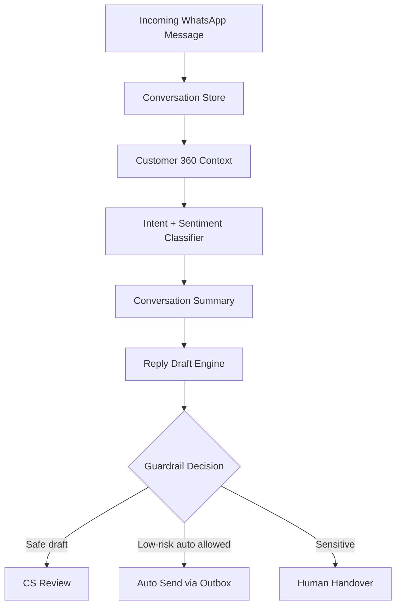

# Rencana Detail WhatsApp Brain + AI Reply CeritaKita

Tanggal: 2026-06-05  
Status: Draft implementasi detail untuk sprint berikutnya  
Owner: CeritaKita Booking  
Scope: WhatsApp Brain, Customer 360, AI-assisted reply, dan limited auto-reply berbasis Watzap.id.

---

## 1. Ringkasan Eksekutif

Setelah jalur kirim pesan WhatsApp melalui Watzap.id mulai siap, langkah paling penting berikutnya bukan langsung memperbesar iklan atau mengaktifkan AI auto-reply penuh, melainkan membangun **otak WhatsApp** terlebih dahulu.

Yang dimaksud otak WhatsApp:

1. sistem menyimpan dan memahami histori chat customer;
2. sistem menghubungkan chat dengan data booking, pembayaran, follow-up, dan status customer;
3. sistem bisa memberi label stage dan intent percakapan;
4. sistem bisa membuat ringkasan konteks customer;
5. sistem bisa menyarankan balasan yang aman untuk CS;
6. sistem baru boleh mengirim otomatis untuk kasus low-risk setelah guardrail dan monitoring siap.

Rekomendasi implementasi:

```text
Brain v1: Customer Context + Intent + Summary
  → AI Draft Reply: CS review lalu klik kirim
  → AI Quality Loop: feedback, template, analytics
  → Limited Auto-Reply: hanya FAQ aman
  → Human Handover + Monitoring ketat
```

Prinsip utama: **AI membantu CS dulu, bukan menggantikan CS dari hari pertama.**

---

## 2. Kondisi Repo Saat Ini

Berdasarkan struktur repo saat dokumen ini dibuat:

| Area | Status | File utama |
|---|---:|---|
| WhatsApp conversation store | Ada | `lib/db.ts`, `lib/repositories/whatsapp.ts` |
| Contacts/conversations/messages | Ada | `whatsapp_contacts`, `whatsapp_conversations`, `whatsapp_messages` |
| Outbox pengiriman | Ada | `message_outbox`, `queueOutbox`, `processOutboxQueue` |
| Watzap send adapter | Ada | `lib/repositories/whatsapp.ts`, `lib/watzap.ts` |
| Watzap provider health/templates | Ada | `app/api/admin/whatsapp/provider/health/route.ts`, `app/api/admin/whatsapp/templates/route.ts` |
| Incoming webhook parser | Ada, route masih legacy WATI | `app/api/wati/webhook/route.ts`, `extractWatzapInboundEvents` |
| WhatsApp Workspace UI | Ada | `components/admin/whatsapp/WhatsAppWorkspace.tsx` |
| CRM label + follow-up | Ada | `crm_label`, `next_fu_at`, `fu_note`, `fu_template_key` |
| Link conversation ke booking | Ada | `booking_id`, API `link-booking` |
| AI brain / draft reply | Belum | Perlu implementasi baru |
| Auto-reply guardrail | Belum | Perlu implementasi baru |

Catatan penting:

- Nama beberapa field masih memakai istilah `wati_*`, tetapi fungsi parser sudah mulai kompatibel dengan payload Watzap/Meta-style.
- Untuk kebersihan jangka panjang, bisa dibuat alias route `/api/watzap/webhook` yang memakai logic ingestion yang sama.
- Jangan rename besar-besaran schema dulu kalau belum perlu; lebih aman tambah adapter/alias agar migration risk rendah.

---

## 3. Tujuan Produk

### 3.1 Tujuan Brain v1

Brain v1 harus menjawab pertanyaan CS sebelum membalas customer:

- Customer ini siapa?
- Histori chat terakhirnya apa?
- Pernah booking apa saja?
- Status booking/payment-nya bagaimana?
- Customer sedang bertanya tentang apa?
- Apakah customer ini urgent, marah, bingung, atau siap booking?
- Balasan aman apa yang bisa dikirim?

### 3.2 Tujuan AI Reply

AI Reply harus membantu CS:

- membuat draft balasan cepat;
- menjaga tone brand CeritaKita;
- menghindari lupa info penting seperti DP, jadwal, paket, dan next step;
- mengurangi response time;
- meningkatkan conversion dari WhatsApp ads ke booking.

### 3.3 Non-goals tahap awal

Tahap awal **tidak** bertujuan untuk:

- auto-reply semua chat;
- mengubah booking otomatis;
- mengkonfirmasi slot jadwal tanpa cek data;
- memutuskan refund/cancel/reschedule otomatis;
- mengirim promo massal;
- mengganti CS sepenuhnya.

---

## 4. Definisi “Otak WhatsApp”

Otak WhatsApp terdiri dari 6 lapisan.



### 4.1 Conversation Store

Data minimum yang sudah/harus tersedia:

| Data | Kegunaan |
|---|---|
| phone number | Identitas utama customer WhatsApp |
| display name | Bantu CS mengenali customer |
| message history | Konteks percakapan |
| direction incoming/outgoing | Hitung response time dan thread state |
| delivery/read status | Monitoring pengiriman |
| raw payload | Debugging provider |
| conversation status | open, pending_human, resolved |

### 4.2 Customer 360 Context

Context yang harus disusun saat conversation dibuka atau saat AI dipanggil:

| Context | Sumber | Prioritas |
|---|---|---:|
| Profil customer: nama, nomor WA | `whatsapp_contacts`, booking/customer fields | Tinggi |
| Chat 20-50 pesan terakhir | `whatsapp_messages` | Tinggi |
| Linked booking aktif | `whatsapp_conversations.booking_id` | Tinggi |
| Histori booking nomor WA yang sama | `bookings.customer_whatsapp` | Tinggi |
| Status pembayaran | booking finance/payments | Tinggi |
| Service/paket/tanggal booking | bookings/services | Tinggi |
| CRM label dan FU | `crm_label`, `next_fu_at`, `fu_note` | Sedang |
| Ads/source bila ada | analytics/utm/leads bila tersedia | Sedang |

### 4.3 Intent Classifier

Intent minimum yang perlu dikenali:

| Intent | Contoh pesan | Aksi sistem |
|---|---|---|
| `price_inquiry` | “harga paket wedding berapa?” | label warm, sarankan pricelist |
| `schedule_check` | “tanggal 20 masih kosong?” | draft minta tanggal/jam/detail atau cek availability |
| `booking_request` | “saya mau booking” | arahkan form/booking step |
| `payment_confirmation` | “sudah transfer DP” | cek linked booking/payment, pending human |
| `reschedule_request` | “bisa ubah jadwal?” | pending human, jangan auto-send keputusan |
| `cancel_request` | “mau batal” | pending human |
| `complaint` | “hasilnya kok belum dikirim?” | pending human + high priority |
| `testimonial` | “makasih hasilnya bagus” | label testimoni, sarankan minta review |
| `follow_up_needed` | “nanti saya kabari” | set next follow-up |
| `unknown` | pesan ambigu | draft tanya klarifikasi |

### 4.4 Sentiment + Urgency

Label tambahan:

| Label | Nilai |
|---|---|
| sentiment | positive, neutral, negative |
| urgency | low, normal, high |
| risk | low, medium, high |
| needs_human | true/false |

Aturan awal:

- `complaint`, `refund`, `cancel`, `reschedule`, `marah`, `kecewa`, `salah jadwal`, `sudah transfer` → minimal `risk=medium`, biasanya `needs_human=true`.
- `harga`, `paket`, `alamat`, `jam buka`, `cara booking` → bisa `risk=low`.

### 4.5 Conversation Summary

Summary harus pendek dan operasional, bukan narasi panjang.

Format rekomendasi:

```text
Customer: [nama/nomor]
Stage: warm / booking / completed / complaint
Kebutuhan: [paket/tanggal/event]
Status booking: [belum ada / linked #ID / DP / lunas / sisa]
Percakapan terakhir: [1-3 poin]
Risiko: [low/medium/high]
Next action: [apa yang CS perlu lakukan]
```

### 4.6 Reply Draft Engine

Draft reply harus memakai sumber konteks yang jelas:

1. histori chat;
2. data booking/payment jika linked;
3. SOP/template CeritaKita;
4. aturan guardrail.

Draft reply tidak boleh mengarang:

- harga;
- promo;
- slot jadwal;
- status pembayaran;
- refund;
- estimasi hasil foto;
- janji khusus yang tidak ada di data.

---

## 5. Data Model Tambahan yang Disarankan

Schema sekarang sudah cukup untuk histori dasar. Untuk brain dan AI, tambahkan tabel kecil bertahap.

### 5.1 `whatsapp_conversation_insights`

Menyimpan hasil analisis terbaru per conversation.

| Field | Type | Catatan |
|---|---|---|
| `id` | TEXT | UUID |
| `conversation_id` | TEXT | FK ke `whatsapp_conversations` |
| `summary` | TEXT | Ringkasan pendek |
| `intent` | TEXT | intent utama terbaru |
| `sentiment` | TEXT | positive/neutral/negative |
| `urgency` | TEXT | low/normal/high |
| `risk_level` | TEXT | low/medium/high |
| `needs_human` | INTEGER | 0/1 |
| `suggested_next_action` | TEXT | next action untuk CS |
| `confidence` | REAL | 0-1 |
| `model_name` | TEXT | model AI yang dipakai |
| `source_message_id` | TEXT | pesan terakhir yang dianalisis |
| `created_at` | DATETIME | timestamp |
| `updated_at` | DATETIME | timestamp |

Index:

- `conversation_id` unique atau latest index;
- `intent`;
- `needs_human`;
- `risk_level`.

### 5.2 `whatsapp_ai_drafts`

Menyimpan draft reply AI dan feedback CS.

| Field | Type | Catatan |
|---|---|---|
| `id` | TEXT | UUID |
| `conversation_id` | TEXT | FK |
| `message_id` | TEXT nullable | pesan customer pemicu |
| `draft_text` | TEXT | isi draft |
| `draft_type` | TEXT | reply, follow_up, clarification, handover |
| `status` | TEXT | drafted, edited, approved, sent, rejected, expired |
| `risk_level` | TEXT | low/medium/high |
| `guardrail_notes` | TEXT | alasan boleh/tidak boleh auto-send |
| `created_by` | TEXT | ai/admin/system |
| `approved_by` | TEXT nullable | admin user |
| `sent_outbox_id` | TEXT nullable | link ke `message_outbox` |
| `model_name` | TEXT | model AI |
| `prompt_version` | TEXT | versi prompt |
| `created_at` | DATETIME | timestamp |
| `updated_at` | DATETIME | timestamp |

### 5.3 `whatsapp_ai_events`

Audit trail untuk AI.

| Field | Type | Catatan |
|---|---|---|
| `id` | TEXT | UUID |
| `conversation_id` | TEXT | FK |
| `event_type` | TEXT | classify, summarize, draft, approve, reject, auto_send, handover |
| `input_snapshot` | TEXT | JSON ringkas, jangan simpan secrets |
| `output_snapshot` | TEXT | JSON hasil AI/guardrail |
| `actor` | TEXT | ai/admin/system |
| `created_at` | DATETIME | timestamp |

Manfaat:

- audit jika AI salah;
- bahan evaluasi kualitas;
- trace kenapa auto-send terjadi.

### 5.4 `whatsapp_knowledge_items`

Knowledge base sederhana untuk SOP/FAQ internal.

| Field | Type | Catatan |
|---|---|---|
| `id` | TEXT | UUID |
| `category` | TEXT | pricing, booking, payment, reschedule, delivery, location, promo |
| `title` | TEXT | judul pendek |
| `content` | TEXT | isi SOP/FAQ |
| `is_active` | INTEGER | 0/1 |
| `updated_by` | TEXT | admin |
| `created_at` | DATETIME | timestamp |
| `updated_at` | DATETIME | timestamp |

Untuk awal, knowledge base bisa hardcoded file/template dulu. Tabel ini baru perlu jika admin ingin edit SOP dari dashboard.

---

## 6. API yang Perlu Dibangun

### 6.1 Generate insight conversation

```http
POST /api/admin/whatsapp/conversations/[id]/ai/insight
```

Fungsi:

- ambil pesan terakhir;
- ambil Customer 360 context;
- jalankan intent/sentiment/summary;
- simpan ke `whatsapp_conversation_insights`;
- return insight terbaru.

Response contoh:

```json
{
  "success": true,
  "insight": {
    "intent": "price_inquiry",
    "sentiment": "neutral",
    "urgency": "normal",
    "riskLevel": "low",
    "needsHuman": false,
    "summary": "Customer menanyakan paket prewedding dan kemungkinan jadwal akhir Juni.",
    "suggestedNextAction": "Kirim pilihan paket dan minta tanggal/jam preferensi.",
    "confidence": 0.82
  }
}
```

### 6.2 Generate draft reply

```http
POST /api/admin/whatsapp/conversations/[id]/ai/draft
```

Body:

```json
{
  "mode": "reply",
  "tone": "friendly_professional",
  "useLatestInsight": true
}
```

Response:

```json
{
  "success": true,
  "draft": {
    "id": "draft-id",
    "text": "Halo Kak, boleh banget...",
    "riskLevel": "low",
    "canAutoSend": false,
    "guardrailNotes": "Draft aman, tapi mode saat ini masih CS review."
  }
}
```

### 6.3 Approve/send draft

```http
POST /api/admin/whatsapp/conversations/[id]/ai/drafts/[draftId]/send
```

Body:

```json
{
  "text": "final text setelah diedit CS"
}
```

Fungsi:

- update status draft ke approved/sent;
- queue ke `message_outbox`;
- panggil `processOutboxQueue`;
- catat audit event.

### 6.4 Reject draft

```http
POST /api/admin/whatsapp/conversations/[id]/ai/drafts/[draftId]/reject
```

Body:

```json
{
  "reason": "Harga tidak sesuai / tone kurang pas / customer perlu human"
}
```

Fungsi:

- feedback loop untuk improve prompt/template;
- bukan training otomatis dulu, cukup audit.

---

## 7. UI WhatsApp Workspace yang Perlu Ditambahkan

File utama: `components/admin/whatsapp/WhatsAppWorkspace.tsx`

### 7.1 Panel AI Context

Di right panel, tambahkan card:

```text
AI Customer Context
- Stage: Warm Lead
- Intent: Tanya harga paket
- Urgency: Normal
- Risk: Low
- Summary: ...
- Suggested next action: ...
[Refresh Insight]
```

### 7.2 AI Draft Box

Di bawah composer chat:

```text
[Generate AI Draft]
Draft:
Halo Kak ...
[Use Draft] [Regenerate] [Reject]
```

Behavior:

- `Generate AI Draft` tidak langsung kirim;
- `Use Draft` memasukkan ke textarea normal;
- CS tetap klik tombol kirim biasa;
- draft yang diedit tetap tercatat sebagai edited.

### 7.3 Risk Indicator

Tampilkan badge:

| Risk | UI |
|---|---|
| low | hijau, boleh draft cepat |
| medium | kuning, wajib review |
| high | merah, jangan auto-send |

### 7.4 Handover Alert

Jika `needs_human=true`:

```text
Percakapan ini perlu CS manusia.
Alasan: customer membahas pembayaran/reschedule/komplain.
AI hanya boleh membuat ringkasan, bukan balasan final.
```

---

## 8. Prompt dan Guardrail

### 8.1 System instruction untuk AI CS

Draft awal:

```text
Kamu adalah assistant CS CeritaKita Studio. Tugasmu membantu admin membuat ringkasan, klasifikasi intent, dan draft balasan WhatsApp.

Aturan wajib:
1. Jangan mengarang harga, promo, jadwal, status pembayaran, atau kebijakan refund.
2. Jika data tidak tersedia, minta klarifikasi atau arahkan ke CS manusia.
3. Untuk pembayaran, refund, cancel, reschedule, komplain, dan perubahan booking, tandai needs_human=true.
4. Gunakan Bahasa Indonesia yang ramah, sopan, singkat, dan natural untuk WhatsApp.
5. Jangan menyebut bahwa kamu AI kecuali diminta.
6. Jangan membocorkan data customer lain.
7. Jangan membuat janji yang tidak ada di context.
8. Jika customer siap booking, arahkan ke next step yang tersedia di context.
```

### 8.2 Output JSON wajib

AI harus output JSON terstruktur, bukan teks bebas.

```json
{
  "intent": "price_inquiry",
  "sentiment": "neutral",
  "urgency": "normal",
  "risk_level": "low",
  "needs_human": false,
  "confidence": 0.82,
  "summary": "...",
  "suggested_next_action": "...",
  "draft_reply": "...",
  "guardrail_notes": "..."
}
```

### 8.3 Hard guardrail sebelum send

Sebelum draft boleh dikirim otomatis, sistem harus cek rule deterministik:

Auto-send **dilarang** jika teks/customer context mengandung:

- transfer, DP, pelunasan, bukti bayar, invoice;
- refund, cancel, batal;
- reschedule, ubah jadwal;
- komplain, kecewa, marah, salah, belum dikirim;
- minta diskon khusus;
- minta alamat/data sensitif customer lain;
- confidence AI < 0.75;
- linked booking tidak jelas untuk pertanyaan booking/payment;
- provider/outbox sedang error.

Auto-send **boleh dipertimbangkan** hanya jika:

- intent low-risk;
- confidence tinggi;
- tidak ada linked booking/payment decision;
- jawaban berasal dari approved FAQ/template;
- mode auto-reply aktif secara eksplisit;
- conversation belum ditandai pending human.

---

## 9. Konfigurasi `.env` untuk Model Otak AI

Otak WhatsApp harus bisa dikontrol dari environment variable supaya aman untuk staging/production dan mudah diganti modelnya tanpa ubah kode.

### 9.1 Prinsip konfigurasi

Default production yang aman:

- AI boleh dimatikan total.
- AI insight dan draft bisa dinyalakan terpisah.
- Auto-send default **mati**.
- Model bisa diganti via `.env`.
- Context chat dibatasi agar biaya AI tidak bocor.
- Low-risk auto intent harus allowlist, bukan semua intent.

### 9.2 Contoh `.env`

```env
# AI CS Brain
AI_CS_ENABLED=false
AI_CS_PROVIDER=openai
AI_CS_MODEL=your-model-name-here

# AI Mode
AI_CS_INSIGHT_ENABLED=true
AI_CS_DRAFT_ENABLED=true
AI_CS_AUTO_SEND_ENABLED=false

# Safety & Cost Control
AI_CS_MAX_CONTEXT_MESSAGES=30
AI_CS_TEMPERATURE=0.2
AI_CS_CONFIDENCE_AUTO_SEND_THRESHOLD=0.85
AI_CS_ALLOWED_AUTO_INTENTS=greeting,location_question,business_hours,basic_booking_steps

# Provider Secret
OPENAI_API_KEY=your_openai_api_key_here
```

Catatan:

- `AI_CS_ENABLED=false` berarti semua fitur AI dimatikan walaupun endpoint tersedia.
- `AI_CS_DRAFT_ENABLED=true` hanya membuat draft; tidak otomatis kirim.
- `AI_CS_AUTO_SEND_ENABLED=false` wajib jadi default sampai kualitas draft terbukti aman.
- `AI_CS_MODEL` bebas diganti sesuai model yang dipilih saat implementasi.
- `AI_CS_MAX_CONTEXT_MESSAGES` menjaga prompt tidak terlalu panjang dan biaya lebih terkendali.
- `AI_CS_TEMPERATURE=0.2` disarankan agar jawaban lebih stabil dan tidak terlalu kreatif.

### 9.3 Mode operasional

| Mode | Env | Perilaku |
|---|---|---|
| AI off | `AI_CS_ENABLED=false` | Hanya deterministic brain, tanpa panggil model AI. |
| Insight only | `AI_CS_ENABLED=true`, `AI_CS_INSIGHT_ENABLED=true`, `AI_CS_DRAFT_ENABLED=false` | AI hanya summary/intent/risk. |
| Draft only | `AI_CS_ENABLED=true`, `AI_CS_DRAFT_ENABLED=true`, `AI_CS_AUTO_SEND_ENABLED=false` | AI membuat draft, CS tetap klik kirim. |
| Limited auto | `AI_CS_AUTO_SEND_ENABLED=true` + allowlist intent | AI boleh auto-send untuk FAQ low-risk saja. |

### 9.4 Provider abstraction

Service AI sebaiknya dibuat melalui wrapper, misalnya:

```text
lib/services/whatsapp-ai-service.ts
```

Wrapper membaca:

- `AI_CS_PROVIDER`;
- `AI_CS_MODEL`;
- provider API key;
- temperature;
- max context messages;
- enabled flags.

Dengan begitu, jika nanti model/provider diganti, perubahan utama cukup di `.env` dan adapter service, bukan di UI atau repository WhatsApp.

### 9.5 Fallback saat AI gagal

Jika AI provider error, timeout, atau output JSON tidak valid:

1. jangan kirim pesan otomatis;
2. tampilkan deterministic context saja;
3. tandai conversation sebagai aman untuk human review;
4. simpan error ke audit/log;
5. UI tetap bisa dipakai CS untuk membalas manual.

---

## 10. Tahapan Implementasi Detail

### Phase 0 — Watzap Inbound Hardening

Tujuan: sebelum AI, pastikan data masuk lengkap.

Task:

1. tambah alias route `/api/watzap/webhook` yang reuse ingestion logic;
2. tetap pertahankan `/api/wati/webhook` untuk backward compatibility sementara;
3. pastikan secret header/query bisa dipakai untuk Watzap;
4. simpan raw payload;
5. test payload incoming text dan status delivery/read.

Acceptance criteria:

- customer kirim pesan → muncul di WhatsApp Workspace;
- pesan tidak double insert;
- outgoing status update tidak bikin message kosong aneh;
- log error jelas jika payload tidak parseable.

### Phase 1 — Brain v1 tanpa AI provider

Tujuan: buat deterministic brain dulu dari data yang sudah ada.

Task:

1. buat helper `buildWhatsAppCustomerContext(conversationId)`;
2. context mengambil:
   - conversation;
   - contact;
   - last N messages;
   - linked booking;
   - bookings dengan nomor WA sama;
   - payment summary;
3. perbaiki classifier keyword existing di `classifyIncomingMessage` jika perlu;
4. expose API insight deterministic sederhana.

Acceptance criteria:

- API bisa return customer context JSON;
- WhatsApp Workspace bisa tampilkan customer summary tanpa AI;
- tidak ada perubahan perilaku send message.

### Phase 2 — AI Insight

Tujuan: AI membaca konteks dan menghasilkan summary/intent.

Task:

1. tambah AI service wrapper, misalnya `lib/services/whatsapp-ai-service.ts`;
2. tambah env:
   - `AI_CS_ENABLED=false` default;
   - `AI_CS_PROVIDER=openai` atau provider lain;
   - `AI_CS_MODEL=...`;
   - `AI_CS_DRAFT_ENABLED=false`;
   - `AI_CS_AUTO_SEND_ENABLED=false`;
3. tambah tabel `whatsapp_conversation_insights`;
4. tambah endpoint `/ai/insight`;
5. simpan audit event.

Acceptance criteria:

- AI insight bisa dibuat manual via tombol;
- output JSON tervalidasi dengan Zod;
- jika AI error, UI tetap jalan dan kasih fallback.

### Phase 3 — AI Draft Reply, CS Review Only

Tujuan: AI membuat draft, tapi manusia tetap kirim.

Task:

1. tambah tabel `whatsapp_ai_drafts`;
2. tambah endpoint `/ai/draft`;
3. tampilkan AI draft box di WhatsApp Workspace;
4. CS bisa use/edit/reject;
5. jika dikirim, tetap lewat outbox existing.

Acceptance criteria:

- AI tidak pernah auto-send di phase ini;
- semua draft punya audit trail;
- CS bisa edit sebelum kirim;
- rejected draft tercatat.

### Phase 4 — Quality Loop + Dashboard Metrics

Tujuan: tahu apakah AI membantu atau mengganggu.

Metrics minimum:

| Metric | Arti |
|---|---|
| draft_generated_count | jumlah draft dibuat |
| draft_used_count | draft dipakai CS |
| draft_edited_count | draft diedit |
| draft_rejected_count | draft ditolak |
| average_response_time | response time WhatsApp |
| pending_human_count | percakapan butuh CS |
| conversion_to_booking | chat yang jadi booking |

Acceptance criteria:

- admin bisa lihat AI membantu berapa banyak;
- owner bisa lihat intent paling banyak dari iklan;
- feedback rejection bisa dievaluasi manual.

### Phase 5 — Limited Auto-Reply Low-Risk

Tujuan: auto-reply hanya untuk FAQ aman.

Intent yang boleh auto-reply awal:

| Intent | Syarat |
|---|---|
| `greeting` | hanya greeting umum |
| `location_question` | alamat studio pasti tersedia |
| `business_hours` | jam operasional pasti tersedia |
| `basic_booking_steps` | menjelaskan langkah booking umum |
| `ask_pricelist` | hanya jika pricelist/FAQ approved tersedia |

Syarat global:

- `AI_CS_AUTO_SEND_ENABLED=true`;
- confidence >= 0.85;
- risk low;
- no linked booking/payment decision;
- no pending human;
- reply max 1 pesan pendek;
- rate limit per conversation.

Acceptance criteria:

- auto-reply bisa dimatikan via env kapan pun;
- semua auto-send tercatat di `whatsapp_ai_events`;
- jika gagal kirim, masuk outbox failure normal;
- CS bisa ambil alih kapan pun.

---

## 11. SOP Balasan Aman

### 11.1 Tanya harga/paket

AI boleh:

- menyapa customer;
- menawarkan bantuan;
- menyebut paket hanya jika data paket tersedia di context/knowledge base;
- minta jenis sesi, tanggal, dan kebutuhan.

AI tidak boleh:

- mengarang harga;
- menjanjikan promo;
- bilang slot tersedia tanpa cek.

### 11.2 Tanya jadwal

AI boleh:

- minta tanggal dan jam preferensi;
- arahkan untuk cek availability.

AI tidak boleh:

- mengkonfirmasi slot kosong tanpa data availability;
- booking otomatis.

### 11.3 Pembayaran / DP / pelunasan

AI boleh:

- membuat summary untuk CS;
- draft respons netral: “Terima kasih Kak, tim kami akan cek pembayaran...”

AI tidak boleh:

- menyatakan pembayaran sudah masuk kecuali data payment valid ada;
- mengubah status booking.

### 11.4 Reschedule/cancel/refund

AI hanya boleh:

- tandai needs human;
- buat ringkasan;
- draft empatik yang tidak menjanjikan keputusan.

### 11.5 Komplain

AI hanya boleh:

- membuat ringkasan;
- draft empatik;
- eskalasi CS.

Contoh aman:

```text
Mohon maaf ya Kak atas kendalanya. Aku bantu teruskan ke tim kami supaya dicek lebih detail. Boleh kami konfirmasi dulu nomor booking atau nama pemesanannya?
```

---

## 12. Rekomendasi Urutan Sprint

### Sprint A: Brain Foundation

Estimasi: 1-2 hari kerja.

Deliverable:

- route `/api/watzap/webhook` alias;
- customer context builder;
- deterministic insight card;
- no AI send.

### Sprint B: AI Insight + Draft

Estimasi: 2-4 hari kerja.

Deliverable:

- AI service wrapper;
- tables insight/draft/event;
- insight API;
- draft API;
- UI draft box;
- audit trail.

### Sprint C: Ads Readiness

Estimasi: 1-2 hari kerja.

Deliverable:

- monitor incoming from ads;
- summary intent source;
- response time dashboard;
- follow-up queue.

### Sprint D: Limited Auto-Reply

Estimasi: setelah 1-2 minggu data draft dievaluasi.

Deliverable:

- allowlist intent;
- auto-send toggle;
- rate limit;
- handover rules;
- rollback switch.

---

## 13. Ads Rollout Strategy Setelah Brain Siap

Jangan langsung pindahkan 100% traffic iklan ke WhatsApp baru sebelum observasi.

Tahapan:

1. **Internal test**: tim kirim 20-50 skenario chat.
2. **Soft launch**: 10-20% budget iklan diarahkan ke WhatsApp baru.
3. **Monitor 3-7 hari**:
   - pesan masuk;
   - response time;
   - outbox failure;
   - draft usage;
   - lead to booking;
   - intent terbanyak.
4. **Scale bertahap**: 50%, lalu 100% jika stabil.

Kriteria siap scale:

- inbox tidak kehilangan pesan;
- CS bisa lihat konteks customer;
- AI draft membantu, bukan membingungkan;
- semua high-risk masuk pending human;
- Watzap send dan webhook stabil.

---

## 14. Risiko dan Mitigasi

| Risiko | Dampak | Mitigasi |
|---|---|---|
| AI salah harga/promo | Trust rusak | harga hanya dari approved source, no hallucination rule |
| AI salah jadwal | Double booking | jangan auto-confirm availability |
| AI salah status pembayaran | Konflik customer | payment intent wajib human |
| Provider webhook payload berubah | Data hilang/salah parse | simpan raw payload + parser adapter |
| Outbox double send | Customer terganggu | idempotency + audit + rate limit |
| CS terlalu percaya AI | Kesalahan operasional | phase awal draft-only |
| Biaya AI membengkak | Cost naik | limit message context, cache insight, manual trigger dulu |
| Privacy data | Data customer bocor | minimalkan context, jangan kirim secrets, audit access |

---

## 15. Checklist Implementasi

### Brain v1

- [ ] Alias webhook Watzap dibuat.
- [ ] Context builder conversation dibuat.
- [ ] Payment summary masuk context.
- [ ] Booking history by phone masuk context.
- [ ] Deterministic intent classifier dirapikan.
- [ ] Insight card muncul di UI.

### AI Draft

- [ ] AI env flags ditambahkan.
- [ ] AI service wrapper dibuat.
- [ ] Zod schema output AI dibuat.
- [ ] Tabel insights/drafts/events dibuat.
- [ ] Endpoint insight dibuat.
- [ ] Endpoint draft dibuat.
- [ ] UI draft box dibuat.
- [ ] Use/edit/reject draft tercatat.

### Safety

- [ ] `AI_CS_AUTO_SEND_ENABLED=false` default.
- [ ] Hard guardrail payment/refund/cancel/reschedule/complaint.
- [ ] Pending human disables auto-send.
- [ ] Auto-send allowlist intent dibuat.
- [ ] Rate limit per conversation dibuat.
- [ ] Audit event untuk semua AI action.

### Ads readiness

- [ ] Provider health Watzap dicek.
- [ ] Incoming webhook production dites.
- [ ] Outbox failure monitoring tersedia.
- [ ] Response time dashboard dicek.
- [ ] Draft quality dievaluasi minimal 1 minggu sebelum auto-reply.

---

## 16. Next Action yang Direkomendasikan

Rekomendasi langkah kerja berikutnya:

1. Implement **Sprint A: Brain Foundation** dulu.
2. Setelah itu implement **Sprint B: AI Insight + Draft**.
3. Jalankan iklan kecil ke WhatsApp baru setelah Brain v1 dan draft-only siap.
4. Tunda limited auto-reply sampai ada data kualitas draft dan guardrail terbukti aman.

Prioritas paling dekat:

```text
/api/watzap/webhook alias
  → buildWhatsAppCustomerContext()
  → insight card deterministic
  → AI draft endpoint draft-only
```
